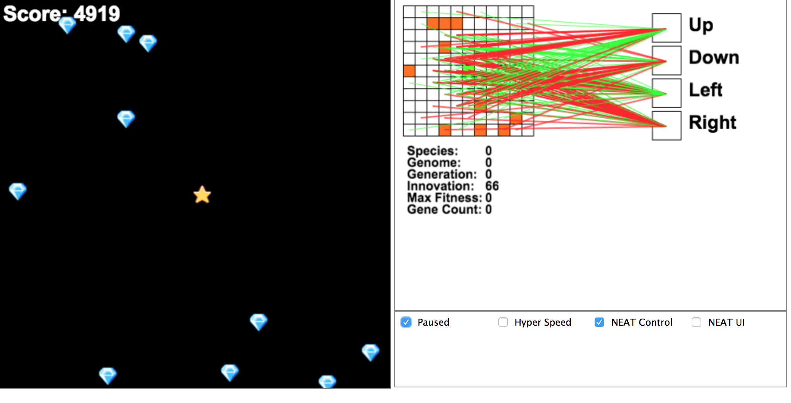

# planetoids

This is a javascript implementation of the NEAT algorithm. The application learns to play a simple, Asteroids-like game by training and combining neural nets over many generations.

NEAT: NeuroEvolution of Augmenting Topologies

Neat Paper : http://nn.cs.utexas.edu/downloads/papers/stanley.ec02.pdf

